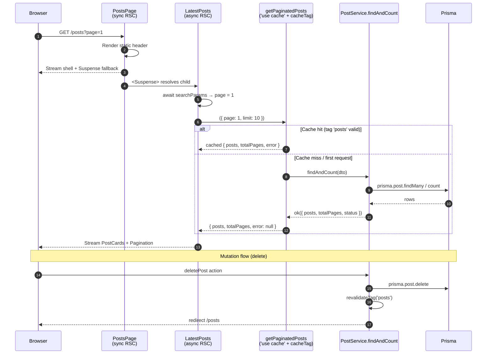

# server-side-paginated-posts — Architecture & Design Document

_Technical architecture and design details. For project planning, timeline, and release planning, see the project plan page._

## Document Info

| Field | Value |
|-------|-------|
| **Project Plan** | [`inputs/requirements.md`](./inputs/requirements.md) |
| **Architect** | Houston Green |
| **Author** | Houston Green (with discovery skill) |
| **Status** | Draft |

---

## Project Overview

The `/posts` list page currently lives entirely in client state. `useGetPaginatedPostsQuery` (`features/posts/hooks/useGetPaginatedPostsQuery.ts`) reads `?page=N` from `useSearchParams`, fetches `GET /api/posts?page=N` through `baseAPI`, and resolves a `Promise` consumed by `<PostCards>` via `use()`. When `deletePost` (`features/posts/actions/deletePost.ts`) calls `revalidatePath(ROUTES.posts)`, the server-side render cache is invalidated but the client-resident `baseAPI`-fetched data is not — the user sees stale posts until a hard navigation.

This project replaces the read flow with a server-rendered list delivered through an async Server Component nested inside `<Suspense>` on a synchronous page. The data path opts into Next.js 16's `'use cache'` directive with `cacheTag('posts')`, and `deletePost` switches to `revalidateTag('posts')`. Tag-based invalidation fans out across every cached `?page=N` variant in a single call, closing the staleness gap and making the read flow behave correctly across all four user flows in `inputs/requirements.md`.

The shape mirrors `app/posts/[id]/page.tsx` + `features/posts/components/postPageContent/postPageContent.tsx` — the canonical sync-page-with-async-child-in-`<Suspense>` reference already in the codebase. The explicit research goal (per `inputs/requirements.md`) is to internalize this pattern as the default for server-driven, cache-invalidatable read flows.



## Existing Implementation

The current read path:

1. `app/posts/page.tsx` is already a synchronous Server Component, but it wraps `<LatestPosts>` (a Client Component) in `<Suspense>` *without a fallback*. The fallback lives one layer deeper inside `LatestPosts`.
2. `features/posts/components/latestPosts/latestPosts.tsx` is `'use client'`. It calls `useGetPaginatedPostsQuery()` (returning a `Promise`) and renders `<Suspense fallback={<p>Loading posts...</p>}><PostCards promise={promise} /></Suspense>`.
3. `features/posts/hooks/useGetPaginatedPostsQuery.ts` reads `page` from `useSearchParams`, calls `baseAPI.get<FindAndCountPostsResponse>(\`${API_ROUTES.posts}?page=${page}\`)`, returns a `PaginatedPostsQuery` (`Promise<{ data, error }>`).
4. `features/posts/components/postCards/postCards.tsx` consumes the promise via `use(promise)` and renders `<Card>` rows.
5. `app/api/posts/route.ts` `GET` handler instantiates `new FindAndCountPostsDto(request)`, calls `PostService.findAndCount(dto)`, returns the `neverthrow` result via `createResponse`.
6. `features/posts/dto/find-and-count-posts.dto.ts` parses `?page` and `?limit` from a `Request` URL via `findAndCountPostsSchema` (`features/posts/schemas/find-and-count-posts.schema.ts`).
7. `features/posts/actions/deletePost.ts` calls `revalidatePath(ROUTES.post(id))` + `revalidatePath(ROUTES.posts)` and `redirect(ROUTES.posts)`. The `revalidatePath` call invalidates the server render cache for `/posts` but does nothing to the `baseAPI`-fetched client state inside `useGetPaginatedPostsQuery` — that's the problem this project exists to fix.

There is no pagination UI on the page today. `?page=N` is editable only via direct URL manipulation. `app/posts/__tests__/posts.page.test.tsx` mocks the GET response through `mockGetPostsResponse` + `postsServer` (msw).

## Proposed Solution

### Read path

`app/posts/page.tsx` stays synchronous. It accepts `searchParams: Promise<{ page?: string }>` and passes the `Promise` through to a new async `LatestPosts` Server Component without awaiting it. The static `<header>` and `<Latest>` heading render immediately. `<Suspense fallback={<p>Loading posts...</p>}>` wraps the async child — the existing fallback hoists from inside `LatestPosts` to inside the page.

`LatestPosts` becomes an `async function` Server Component. It awaits `searchParams`, normalizes `page` to a non-negative integer, calls `getPaginatedPosts({ page, limit: 10 })`, and renders `<PostCards posts={posts} />` plus `<Pagination currentPage={page} totalPages={totalPages} />`. The `'use client'` directive and the `useGetPaginatedPostsQuery` import disappear.

`getPaginatedPosts({ page, limit })` is a new server-side function in `features/posts/actions/getPaginatedPosts.ts` (action-folder path for symmetry with `getPost`, but **without** the `'use server'` directive — see "Read entry" below). It opens with `'use cache'`, calls `cacheTag('posts')`, instantiates `new FindAndCountPostsDto({ page, limit })` (DTO shape change — see "DTO change"), calls `PostService.findAndCount(dto)`, and returns `{ error, posts, totalPages }` on success or `{ error, posts: [], totalPages: 0 }` on error. Mirrors `getPost`'s `result.match(...)` shape.

`PostCards` props change from `{ promise: PaginatedPostsQuery }` to `{ posts: AuthoredPost[] }`. The `use(promise)` call goes away. The error branch goes away (errors are handled at `LatestPosts` level since it has the result envelope, not just a promise). `PaginatedPostsQuery` type is deleted.

### Mutation path

`deletePost` swaps `revalidatePath(ROUTES.post(id))` + `revalidatePath(ROUTES.posts)` for `revalidateTag('posts')`. The `redirect(ROUTES.posts)` stays. The `redirect` strips query params and lands the user on page 1 — intentional per Flow 4 in `inputs/requirements.md` ("Admin User is taken back to the posts page **and clicks on page 2**" — the manual re-navigate is the spec).

### Cache key, tag, and invalidation contract

- **Cache key.** `getPaginatedPosts` is keyed by `{ page, limit }` per the `'use cache'` cache-key rules (build ID + function ID + serialized arguments). Each `?page=N` request maps to a separate cache entry.
- **Tag.** Every entry is tagged `'posts'` via `cacheTag('posts')`.
- **Invalidation.** `revalidateTag('posts')` from `deletePost` invalidates *every* cached entry tagged `'posts'` — across every `?page=N` value, in one call. This is the property `revalidatePath` cannot give us cleanly, and it's the correctness fix at the heart of the project.
- **`cacheLife`.** Default profile (5min stale / 15min revalidate / no expire) is fine for this use case. The list isn't latency-critical and doesn't need tighter SLOs. If observed staleness becomes a problem post-launch, swap to `cacheLife({ revalidate: 60 })` or similar.

### Read entry — why service-direct, not a `'use server'` action

`'use cache'` and `'use server'` are mutually exclusive at the function level. To cache, the read entry cannot be a server action. The function lives at `features/posts/actions/getPaginatedPosts.ts` for filesystem symmetry with `getPost.ts`, but the file omits `'use server'` at the top — only `'use cache'` lives inside the function body. Callable only from RSCs (which is all we need — no client-component callers exist).

### DTO change

The current `FindAndCountPostsDto` (`features/posts/dto/find-and-count-posts.dto.ts`) takes a `Request`, reads `?page` / `?limit` off the URL, and validates via Zod. It's only called from `app/api/posts/route.ts`'s `GET` handler — which PR 4 deletes. So the `Request`-based shape is dead code in the steady state.

PR 2 replaces the `Request`-based constructor outright with a primitives constructor: `new FindAndCountPostsDto({ page, limit })`. The Zod schema (`findAndCountPostsSchema`) and validation flow stay; only the input shape changes. The GET handler in PR 2 is updated to read `searchParams` itself and pass primitives to the DTO; PR 4 then deletes the handler entirely.

This is option (c) from the original DTO-shape todo: replace outright in PR 2. Rationale: avoids carrying a transitional dual-mode DTO across the PR sequence for code that's deleted two PRs later.

---

## User-Facing Behavior

### Personas

| Persona | Role | Key Actions | Auth Context |
|---------|------|-------------|--------------|
| Visitor | Anonymous reader | View posts list, paginate, view individual post | None — read is public |
| Admin | Authenticated admin | All Visitor actions + create / delete posts | NextAuth.js v4 session, `posts.delete` permission |

### User Flows

The four flows from `inputs/requirements.md`, with the system interactions called out.

#### Flow 1: Viewing Posts (Visitor or Admin)

1. User navigates to `/posts` (or `/posts?page=N`).
2. `PostsPage` (sync RSC) streams the static header + `<Suspense>` fallback to the browser.
3. `LatestPosts` (async RSC) awaits `searchParams`, calls `getPaginatedPosts({ page, limit: 10 })`. On cache hit, the result returns immediately; on miss, the call hits Prisma and the result is cached and tagged `'posts'`.
4. `LatestPosts` renders `<PostCards posts={posts} />` and `<Pagination currentPage={page} totalPages={totalPages} />`.
5. User clicks a pagination link. The `<Pagination>` component renders `<Link href="/posts?page=N+1">` items; the click is a soft navigation, `?page` updates, the page re-renders with the new `searchParams` Promise, the cached entry for that page (if any) returns immediately.
6. User clicks a post card. `<Link href={ROUTES.post(post.id)}>` navigates to `/posts/[id]`.

#### Flow 2: Creating a Post (Admin) — out of scope

Defined in `inputs/requirements.md` for completeness; the create flow remains on `tryPostNewPost` + `POST /api/posts` and is migrated by a separate project. See [Scope Boundaries](#scope-boundaries).

#### Flow 3: Deleting a Post (Admin)

1. Admin opens `AdminMenuDialog` from the posts page.
2. Admin clicks "Delete" on a post.
3. `deletePost` server action runs: `PostService.delete(...)` → `revalidateTag('posts')` → `redirect(ROUTES.posts)`.
4. Browser lands on `/posts` (no `?page`). `revalidateTag('posts')` invalidated every cached `getPaginatedPosts` entry; the next render fetches fresh data for page 0.
5. Admin sees the post is gone.

#### Flow 4: Deleting a Post from Page 2 (Admin)

Same as Flow 3, except after the redirect the admin manually clicks "Page 2" in the pagination control. That click navigates to `/posts?page=1` (zero-indexed) — and because `revalidateTag('posts')` already invalidated *all* page-keyed cache entries, page 2 also returns fresh data on first render.

### Scope Boundaries

**In scope:**
- Pagination component primitives: Shadcn `<Pagination>` install at `globals/components/ui/pagination/`, one component per file, with per-component tests. Reuses existing `BUTTON_VARIANTS`.
- Read flow migration: `useGetPaginatedPostsQuery` → cached `getPaginatedPosts` server function called from an async Server Component.
- DTO shape change: `FindAndCountPostsDto` accepts `{ page, limit }` primitives.
- Mutation invalidation: `deletePost` swaps `revalidatePath` for `revalidateTag('posts')`.
- Feature-level pagination wrapper: `features/posts/components/pagination/` driven by `?page=N` via `next/link`, consuming the primitives.
- Deletion of `app/api/posts/route.ts` `GET` handler, its `__tests__/GET.db.test.ts`, and the `mockGetPostsResponse` msw helper. Preserves `POST` for `createPost`.
- Test updates: new action db-test, rewritten `latestPosts.test.tsx` and `posts.page.test.tsx`, deleted `useGetPaginatedPostsQuery.test.ts`.

**Out of scope:**
- `createPost` migration off `tryPostNewPost` / HTTP. Tracked as a separate project.
- `POST /api/posts` deletion. Coupled to the `createPost` migration.
- Post update functionality. None exists today.
- Visual redesign of the posts page or post cards.
- Schema / data-model changes.
- Loading and error UX rework. The existing `<p>Loading posts...</p>` Suspense fallback survives the rewrite, hoisted from inside `LatestPosts` to inside `PostsPage`. Engineer-confirmed in `inputs/requirements.md` § Edge Cases & Error States.
- i18n. The codebase has no `next-intl` / `i18next` / `useTranslations` infrastructure. Strings ship hardcoded as they do everywhere else.
- Internationalized number formatting in pagination.

### Edge Cases & Error States

| Scenario | Expected Behavior |
|----------|-------------------|
| Invalid `?page` (`"abc"`, negative, very large) | `findAndCountPostsSchema` coerces; non-numeric → Zod error → `LatestPosts` renders the error branch. Existing schema `transform((page) => page \|\| 0)` already collapses `0` / falsy / NaN to page 0. |
| `?page` greater than `totalPages` | `prisma.post.findMany` with a too-large `skip` returns an empty array; `LatestPosts` renders `<PostCards posts={[]} />` (empty card group) and `<Pagination>` with the requested page — pagination control still highlights the requested page but the list is empty. Acceptable for MVP; matches current behavior. |
| Prisma error during read | `PostService.findAndCount` returns an `entity` error envelope → `getPaginatedPosts` returns `{ error, posts: [], totalPages: 0 }` → `LatestPosts` renders `<p data-testid="latest-posts-error">Something went wrong</p>` (preserving the existing `data-testid` so test assertions carry over). |
| Cache miss under load | First request per `{ page, limit }` combo hits Prisma; subsequent requests within `cacheLife` window read from in-memory LRU. No user-visible difference beyond first-request latency. |
| Stale cache between revalidations | `cacheLife` default: stale at 5min (client), revalidate at 15min (server). Acceptable for a portfolio site; if observed staleness becomes a complaint post-launch, tighten `cacheLife`. |
| Concurrent deletes from two admin sessions | Both calls run their own `revalidateTag('posts')`. Tag invalidation is idempotent; the second call is a no-op against an already-invalidated tag. No race risk. |
| Mutation followed by immediate read on the same request | `revalidateTag` invalidates synchronously within the request lifecycle; the redirect's subsequent render fetches fresh data. |

---

## Implementation Details

### Data Model

No schema changes. `Post` model unchanged.

### Security Considerations

- Read path is public (`PostService.findAndCount` has no auth branch). No change.
- `deletePost` remains admin-gated via `PostService.delete` → `authenticateAPISession` → `authorizeUser('delete')`. No change.
- `'use cache'` cache key is keyed on `{ page, limit }` — no auth-scoped data flows through, so no risk of leaking admin-visible state to anonymous viewers via the cache layer. Posts are public regardless of viewer role.

### Backend Routing

**PR 4 deletes:**

- `GET /api/posts` route handler (the `GET` export in `app/api/posts/route.ts`). The `POST` export survives — `createPost` still uses HTTP.

**No new routes.** The new read entry (`getPaginatedPosts`) is a server-side function called only from RSCs, not a route.

### Services / Workers

#### `getPaginatedPosts` — new cached read entry

- **Location:** `features/posts/actions/getPaginatedPosts.ts` (filesystem symmetry with `getPost.ts`).
- **Directives:** `'use cache'` at the top of the function body (not the file). **No `'use server'`** — the two are mutually exclusive at the function level, and we need cache.
- **Signature:** `async function getPaginatedPosts(params: { page: number; limit?: number }): Promise<{ error: ... | null; posts: AuthoredPost[]; totalPages: number }>`.
- **Body:**
  1. `'use cache'`
  2. `cacheTag('posts')`
  3. `const result = await PostService.findAndCount(new FindAndCountPostsDto({ page, limit: limit ?? 10 }))`
  4. `result.match(...)` — success returns `{ error: null, posts, totalPages }`; error returns `{ error, posts: [], totalPages: 0 }`. The `default` branch logs `UNHANDLED_FIND_AND_COUNT_POSTS_ERROR`. Mirrors `getPost`'s shape.
- **Callers:** `LatestPosts` only.
- **Cache lifetime:** default `cacheLife` (5min stale / 15min revalidate). Override only if post-launch monitoring shows staleness.

#### `PostService.findAndCount` — unchanged

The service signature is already `findAndCount(dto: FindAndCountPostsDto)` and returns `{ posts, status, totalPages }` in a `neverthrow` envelope. Compatible with the new read entry; no changes.

#### `FindAndCountPostsDto` — primitives constructor

- **Location:** `features/posts/dto/find-and-count-posts.dto.ts` (existing file).
- **Constructor change:** `constructor({ page, limit }: { page: number; limit?: number })` replaces `constructor(request: Request)`. The internal `searchParams` getter and `validateParams` flow now reads from the primitive inputs, but the Zod schema (`findAndCountPostsSchema`) is unchanged — `coerce.number()` accepts both string and number, so the schema doesn't care.
- **Migration shape:** outright replacement, not widening. The `Request`-based call site (`app/api/posts/route.ts` `GET`) is updated in PR 2 to extract `searchParams` and pass primitives, then deleted in PR 4.

#### `deletePost` — invalidation primitive swap

- **Location:** `features/posts/actions/deletePost.ts` (existing file).
- **Change:** the success branch becomes:
  ```ts
  () => {
    revalidateTag('posts')
    redirect(ROUTES.posts)
  }
  ```
  The two `revalidatePath` calls (`ROUTES.post(state.id)` and `ROUTES.posts`) are removed. `revalidateTag('posts')` covers the list invalidation; the post-detail page (`/posts/[id]`) doesn't need its own tag — once the post is deleted, navigating to `/posts/[id]` produces a `NotFoundError` from `PostService.findOne` which `PostPageContent` already handles.
- **Test impact:** `vitest.setup.tsx` already mocks `revalidateTag` (line 16), so test scaffolding is unchanged.

### Frontend

#### Component hierarchy (after migration)

```
PostsPage (sync RSC)
├─ AdminMenuContentSetter (PostsPageAdminMenuContent)
└─ <main>
   ├─ <header> (static — name/typewriter, no data)
   └─ <article>
      └─ <Suspense fallback={<p>Loading posts...</p>}>
         └─ LatestPosts (async RSC)
            ├─ getPaginatedPosts({ page, limit: 10 })  ← cached, tagged 'posts'
            ├─ PostCards (RSC, props: { posts })
            └─ Pagination (Client Component, props: { currentPage, totalPages })
                └─ next/link items
```

#### `PostsPage` — `app/posts/page.tsx`

- Stays synchronous. Renders the static header and the column wrapper.
- New props: `{ searchParams: Promise<{ page?: string }> }`. Passes the Promise through to `LatestPosts` without awaiting it.
- `<Suspense>` gets a `fallback={<p>Loading posts...</p>}` (hoisted from inside `LatestPosts`).
- Mirrors the shape of `app/posts/[id]/page.tsx` exactly, with `searchParams` substituted for `params`.

#### `LatestPosts` — `features/posts/components/latestPosts/latestPosts.tsx`

- Drops `'use client'`. Becomes `async function LatestPosts({ searchParams }: { searchParams: Promise<{ page?: string }> })`.
- Awaits `searchParams`, parses `page` (`Number(page) || 0`), calls `getPaginatedPosts({ page })`.
- On error, returns `<p data-testid="latest-posts-error">Something went wrong</p>` (existing `data-testid` preserved).
- On success, returns:
  ```tsx
  <div aria-live="polite" data-testid="latest-posts">
    <PostCards posts={posts} />
    <Pagination currentPage={page} totalPages={totalPages} />
  </div>
  ```
- The internal `<Suspense>` and `useGetPaginatedPostsQuery` go away.

#### `PostCards` — `features/posts/components/postCards/postCards.tsx`

- Props change: `{ promise: PaginatedPostsQuery }` → `{ posts: AuthoredPost[] }`.
- The `use(promise)` consumption goes away. The `error` branch goes away.
- Map over `posts` and render `<Card>` rows as before. Behavior on empty array: empty `<CardGroup>` (no posts, no error message — acceptable per [Edge Cases](#edge-cases--error-states)).

#### `Pagination` — primitives + feature wrapper, split across PR 1 and PR 3

This work breaks into two distinct units:

**PR 1 — Pagination primitives.** Shadcn's `<Pagination>` reference primitive copy-pasted in, split one-component-per-directory to match the codebase convention (`globals/components/ui/button/`, `heading/`, `spinner/`, `toaster/` all follow this shape). No new dependency.

| Directory | Component | Element | Notes |
|---|---|---|---|
| `globals/components/ui/pagination/` | `<Pagination>` | `<nav>` | `aria-label="pagination"` default; consumer can override |
| `globals/components/ui/paginationContent/` | `<PaginationContent>` | `<ul>` | `data-slot="pagination-content"` |
| `globals/components/ui/paginationItem/` | `<PaginationItem>` | `<li>` | `data-slot="pagination-item"` |
| `globals/components/ui/paginationLink/` | `<PaginationLink>` | `<a>` (or `next/link`) | Accepts `isActive?: boolean`. Active sets `aria-current="page"`. Styled via `BUTTON_VARIANTS({ variant: isActive ? 'outline' : 'ghost', size: 'icon-sm' })` from `globals/components/ui/button/constants.ts` — **reuses existing variants**, no new `constants.ts`. |
| `globals/components/ui/paginationPrevious/` | `<PaginationPrevious>` | wraps `<PaginationLink>` | Renders `lucide-react`'s `ChevronLeft` + the text "Previous". `aria-label="Go to previous page"`. |
| `globals/components/ui/paginationNext/` | `<PaginationNext>` | wraps `<PaginationLink>` | Renders `lucide-react`'s `ChevronRight` + the text "Next". `aria-label="Go to next page"`. |
| `globals/components/ui/paginationEllipsis/` | `<PaginationEllipsis>` | `<span>` | Renders `lucide-react`'s `MoreHorizontal`. `aria-hidden="true"` plus an SR-only "More pages" text. |

Each directory contains a `<componentName>.tsx`, an `index.ts` re-exporting the component, and a co-located `__tests__/<componentName>.test.tsx`. `globals/components/ui/index.ts` gains 7 new `export * from './<componentName>'` lines. Tests are smoke-level: render + ARIA defaults + `data-slot` + `isActive` → `aria-current="page"` on `<PaginationLink>` + correct icon imports on prev/next/ellipsis.

PR 1 is purely additive — these components ship to `main` ahead of any consumer. They're dead code until PR 3 imports them, which is the same posture as adding any new Shadcn primitive ahead of its first use.

**PR 3 — Feature-level wrapper (`features/posts/components/pagination/`).** Single feature component at `features/posts/components/pagination/pagination.tsx` (one component per file). Public API: `<Pagination currentPage={number} totalPages={number} />`.

Responsibilities:
- Accept `{ currentPage, totalPages }`.
- Compute the visible page list (truncation rule below).
- Render the primitive composition: `<Pagination> > <PaginationContent> > [<PaginationPrevious>, ...page items, <PaginationNext>]` with `<PaginationLink href={`${ROUTES.posts}?page=${n}`} isActive={n === currentPage}>` items and `<PaginationEllipsis>` for gaps.
- Disable `<PaginationPrevious>` at `currentPage === 0` and `<PaginationNext>` at `currentPage === totalPages - 1` (`aria-disabled="true"` + `pointer-events-none` so clicks no-op without changing visual rhythm).

**Page-list truncation rule.** If `totalPages <= 7`, render all pages `[1..totalPages]`. Otherwise render `[1, …, currentPage-1, currentPage, currentPage+1, …, totalPages]` with `<PaginationEllipsis>` for non-adjacent gaps. Edge cases (currentPage at 0 or `totalPages - 1`, totalPages = 0/1) pinned in the truncation table — see `todos.md` → "Page-list truncation spec".

**Truncation logic placement — implementation-time call.** Default: keep the page-list computation inline in the wrapper. If during PR 3 implementation it grows beyond a few clear branches (boundary conditions, ellipsis-collapse logic, off-by-ones for window size > 1, etc.), extract to a sibling pure util (`features/posts/components/pagination/getTruncatedPageList.ts`) with its own `__tests__/getTruncatedPageList.test.ts`. The "complicated enough to extract" call is made by the implementer — engineer guidance is the principle, not the line count. See `decisions.md` → "Truncation logic placement: implementation-time call".

**Why Shadcn over `react-headless-pagination`:** already aligns with the codebase's `cn` + `cva` + `data-slot` patterns (`globals/components/ui/button/button.tsx`); reuses `BUTTON_VARIANTS` directly; no `package.json` churn. See `decisions.md` → "Q2 resolved: Shadcn `<Pagination>` over `react-headless-pagination`".

#### State management

None. Pagination state lives entirely in the URL (`?page=N`), driven by `next/link` navigations. No Client Component owns paginated state. The only Client Component touching state is the (currently nonexistent) admin menu logic, which is unrelated.

### i18n String Table

**Not applicable.** The codebase has no i18n infrastructure (`next-intl`, `i18next`, `useTranslations`, `getTranslations` — none present per repo grep). Strings ship hardcoded:

| String | Location |
|--------|----------|
| `Loading posts...` | `<Suspense>` fallback in `PostsPage` |
| `Something went wrong` | Error branch of `LatestPosts` |
| Pagination labels (`Previous`, `Next`, ARIA labels) | Shadcn defaults; English |

If i18n lands later, all five strings move to a locale file in one pass.

### Icon & Asset Mapping

**Not applicable.** No design map (`inputs/design-map.md` was skipped per `decisions.md` → "Skip design map"). Pagination's `Previous` / `Next` arrows ship from `lucide-react` (already a dep) inside Shadcn's `<PaginationPrevious>` / `<PaginationNext>` defaults — no new icons sourced from designs.

### Integrations

None. No internal or external platform integrations. The change is entirely within `app/`, `features/posts/`, and `globals/components/ui/`.

### Infrastructure / Hosting

No change. Already running on Vercel with `cacheComponents: true` (`next.config.ts:6`). The `'use cache'` in-memory LRU is the default (no `cacheHandlers` configured) — fine for a portfolio site. If post-launch metrics show single-instance memory pressure, swap to `'use cache: remote'` with a Vercel KV handler. Not anticipated.

### Testing Strategy

**Vertical slice that proves the approach:** PR 2's `getPaginatedPosts.db.test.ts` (mirrors `getPost.db.test.ts`) plus a small integration assertion — call `getPaginatedPosts({ page: 0 })` against a seeded DB, assert posts. This proves the read entry, the DTO change, and the cache directive don't regress correctness. It does *not* prove cache-tag invalidation (see "What NOT to test").

#### PR 1 tests — pagination primitives

One test file per component, co-located in each component's own `__tests__/` directory:

- `globals/components/ui/pagination/__tests__/pagination.test.tsx` — `<Pagination>` renders a `<nav>` with `aria-label`; passes through `className` / `data-*`.
- `globals/components/ui/paginationContent/__tests__/paginationContent.test.tsx` — `<PaginationContent>` renders a `<ul>` with `data-slot="pagination-content"`.
- `globals/components/ui/paginationItem/__tests__/paginationItem.test.tsx` — `<PaginationItem>` renders an `<li>` with `data-slot="pagination-item"`.
- `globals/components/ui/paginationLink/__tests__/paginationLink.test.tsx` —
  - Renders an `<a>` (or whatever `<PaginationLink>` resolves to in the install — possibly `next/link`).
  - With `isActive={true}` sets `aria-current="page"` and applies `outline` variant styling.
  - With `isActive={false}` (default) omits `aria-current` and applies `ghost` variant styling.
  - Forwards `href`, `onClick`, and other anchor props.
- `globals/components/ui/paginationPrevious/__tests__/paginationPrevious.test.tsx` — renders `ChevronLeft` icon, has `aria-label="Go to previous page"`, includes the visible "Previous" text.
- `globals/components/ui/paginationNext/__tests__/paginationNext.test.tsx` — renders `ChevronRight` icon, has `aria-label="Go to next page"`, includes the visible "Next" text.
- `globals/components/ui/paginationEllipsis/__tests__/paginationEllipsis.test.tsx` — renders `MoreHorizontal` icon, is `aria-hidden="true"`, includes SR-only "More pages" text.

These are smoke tests, not behavior tests — the primitives are pure render adapters with no internal logic to break. Behavior coverage lives in PR 3's feature-wrapper test.

#### PR 2 tests — backend additive

- `features/posts/actions/__tests__/getPaginatedPosts.db.test.ts` — new file. Mirrors `getPost.db.test.ts` shape:
  - Success path: spy on `PostService.findAndCount`, assert returned `{ error: null, posts, totalPages }`.
  - Entity error: mock `PostService.findAndCount` to return `errAsync({ type: 'entity', ... })`, assert `{ error, posts: [], totalPages: 0 }`.
  - DTO error: pass invalid input (e.g., `{ page: -1 }` or `{ page: NaN }`); assert Zod path. Note: validates via `findAndCountPostsSchema`, not at the action level.
  - Unhandled error: mock unknown error type, assert `logger.error` is called with the `UNHANDLED_FIND_AND_COUNT_POSTS_ERROR` message.
  - Integration: `setupTestDatabase({ withPosts: true, withUsers: true })`, call `getPaginatedPosts({ page: 0 })`, assert ordering + `totalPages`.
- `features/posts/dto/__tests__/find-and-count-posts.dto.test.ts` — update existing tests for the primitives constructor. Drop `Request`-based test cases.
- `features/posts/actions/__tests__/deletePost.test.ts` (existing) — update to assert `revalidateTag('posts')` is called (`vitest.setup.tsx` already mocks it) instead of `revalidatePath(ROUTES.posts)` / `revalidatePath(ROUTES.post(id))`.
- `app/api/posts/__tests__/GET.db.test.ts` — update for the DTO change (handler now reads `searchParams` and passes primitives). Stays in PR 2; deleted in PR 4.

#### PR 3 tests — frontend cutover

- `app/posts/__tests__/posts.page.test.tsx` — rewrite. The current test renders `<PostsPage />` directly and relies on the msw GET. Post-conversion shape: spy on `PostService.findAndCount` (mocked-service branch) — fast, no DB. Reasoning: `posts.page.test.tsx` is an RTL render test, not a db-test; the new `getPaginatedPosts.db.test.ts` covers integration. Page test asserts:
  - `h1` renders (`posts-page-heading`).
  - Suspense fallback renders before the async child resolves.
  - Async child renders post cards once resolved (`findByTestId('card-...')`).
  - Pagination control renders.
  - Admin menu content renders (existing assertion).
  - Error branch renders the `latest-posts-error` element when `findAndCount` returns an error envelope.
- `features/posts/components/latestPosts/__tests__/latestPosts.test.tsx` — rewrite. Currently uses `mockGetPostsResponse` (msw) — that helper is going away in PR 4, so the test must move off it before PR 4 ships. Replace with `vi.spyOn(PostService, 'findAndCount')` setting up success / error returns and `await act(() => render(<LatestPosts searchParams={Promise.resolve({ page: '0' })} />))`. Assertions match current ones (links to post pages, error message on failure).
- `features/posts/hooks/__tests__/useGetPaginatedPostsQuery.test.ts` — **delete** (the hook is deleted in PR 3).
- New: `features/posts/components/pagination/__tests__/pagination.test.tsx` — feature wrapper behavior. Render with `{ currentPage: 1, totalPages: 5 }`; assert links exist with `href={'/posts?page=N'}`; assert `aria-current="page"` on the active page; assert "Previous" disabled (`aria-disabled="true"`) at page 0; assert "Next" disabled at last page; assert ellipses appear at the right boundaries for `totalPages > 7`. Drives the truncation table from `todos.md` → "Page-list truncation spec".
- New (conditional): `features/posts/components/pagination/__tests__/getTruncatedPageList.test.ts` — only if the truncation logic is extracted to a sibling util during implementation. Pure-function tests across the truncation table (`(currentPage=0, totalPages=1)` → `[1]`; `(currentPage=4, totalPages=10)` → `[1, '…', 4, 5, 6, '…', 10]`; etc.). If logic stays inline in the wrapper, those assertions live inside `pagination.test.tsx` instead.

#### PR 4 tests — backend cleanup

- `app/api/posts/__tests__/GET.db.test.ts` — **delete**.
- `test/servers/postsServer.ts` — keep `postsServer` and the `POST /api/posts` handler; remove the `GET /api/posts` handler and the `mockGetPostsResponse` helper. Update `test/servers/index.ts` exports accordingly.

#### What NOT to test

- **Cache-tag invalidation E2E.** Verifying `revalidateTag('posts')` actually invalidates a `'use cache'` entry would require a runtime Next.js server (not Vitest's jsdom + msw). The closest test would be a Playwright flow. Out of scope — `vitest.setup.tsx` mocks `revalidateTag` to a `vi.fn`, so we can only assert the *call*, not the effect. That's fine: the contract is documented in the Next.js 16 docs, not invented here. If we want runtime confidence later, add a Playwright "delete a post on page 2, navigate away, navigate back, verify the post is gone" assertion.
- **`'use cache'` directive observability inside Vitest.** Vitest doesn't run the `cacheComponents` pipeline. Tests assert the function's *return shape*, not whether the cache layer activated. The directive is verified by production-traffic correctness, not by unit tests.

### Feature Flag Strategy

**No feature flag.** Per `inputs/requirements.md` § Rollout & Feature Flags: "This feature will go straight to main." The codebase has no feature-flag infrastructure today, and the rollout is a 4-PR sequence to `main` with no preview-traffic gating.

The 4-PR shape is its own form of progressive rollout:
- **PR 1** ships pagination primitives only — additive, dead code until PR 3 imports them. Zero user-visible impact.
- **PR 2** is backend additive — new code paths land but the user-facing page still consumes the old client hook.
- **PR 3** is the cutover — when this lands, the user-facing read path changes. If a regression appears, PR 3 is the revert target.
- **PR 4** is pure deletion — by the time it ships, PR 3 has been live and any read-path regression would already be visible.

If a flag is ever needed retroactively, the cleanest split point is around `PostCards`'s `posts` prop — gate the entire `LatestPosts` async branch behind a flag and fall back to the (still-deployed-in-PR-3 git history) client-hook implementation.

### Rollout Plan

The 4-PR ship plan is the rollout. From `decisions.md` → "Ship plan: 4 PRs (pagination install → backend additive → frontend cutover → backend cleanup)":

| PR | Scope | What lands | What does not | Reversibility |
|----|-------|-----------|---------------|---------------|
| 1 | Pagination primitives, additive | Shadcn `<Pagination>` install, one component per directory under `globals/components/ui/` (`pagination/`, `paginationContent/`, `paginationItem/`, `paginationLink/`, `paginationPrevious/`, `paginationNext/`, `paginationEllipsis/`); each with its own `index.ts` and `__tests__/`; `globals/components/ui/index.ts` gains 7 new export lines; reuses `BUTTON_VARIANTS` from `globals/components/ui/button/constants.ts`. | No `app/`, no `features/`, no `next.config.ts`. Pure new files under `globals/components/ui/`. | Safe to ship alone. Components are unimported; revert is a clean delete. |
| 2 | Backend, additive | `getPaginatedPosts` (`'use cache'` + `cacheTag('posts')`); `FindAndCountPostsDto` primitives constructor; `deletePost` swaps to `revalidateTag('posts')`; `app/api/posts/route.ts` `GET` updated to pass primitives; new + updated backend tests. | No `app/posts/page.tsx`, no `features/posts/components/`, no `features/posts/hooks/` changes. | Safe to ship alone. The `GET` handler still works; `useGetPaginatedPostsQuery` still consumes it. `revalidateTag('posts')` is a no-op against an empty tag set (no `'use cache'` callers exist yet to tag entries) — but the *next* PR introduces them, so the call is forward-compatible. |
| 3 | Frontend, cutover | Sync `app/posts/page.tsx` with `<Suspense>` fallback; new async `LatestPosts` (RSC); `PostCards` props change to `{ posts }`; `useGetPaginatedPostsQuery` + tests deleted; `PaginatedPostsQuery` type deleted; new feature wrapper `features/posts/components/pagination/pagination.tsx` consuming PR 1's primitives; rewritten `posts.page.test.tsx` and `latestPosts.test.tsx`; new `pagination.test.tsx` (and conditional `getTruncatedPageList.test.ts` if extracted). | No `app/api/posts/`, no `features/posts/post.{service,repository}.ts`, no `features/posts/dto/` changes. | Revertable as one commit. After this lands, `revalidateTag('posts')` from `deletePost` is doing real work and the user-facing list reads from cache. |
| 4 | Backend cleanup | `app/api/posts/route.ts` `GET` export deleted (file slimmed to POST-only); `app/api/posts/__tests__/GET.db.test.ts` deleted; `test/servers/postsServer.ts` `GET` handler + `mockGetPostsResponse` helper deleted. | No frontend touched. Pure deletion. | Revertable. After this, no transitional dead handler is on `main`. |

**Migration safety:** No migrations. No backfill. No data shape change.

**Rollback plan:** If a regression appears post-PR-3, revert PR 3. PR 1 and PR 2 changes are inert without the frontend cutover (except for `deletePost`'s tag swap, which is harmless — `revalidateTag('posts')` against zero cached entries is a no-op).

**Phased rollout (informal):** PR 1 → soak briefly (primitives are inert) → PR 2 → soak on `main` through at least one delete-flow exercise → PR 3 → soak through one delete-flow exercise (verify Flow 3 / Flow 4 work end-to-end) → PR 4.

**Why pagination first:** PR 3 is the only PR that needs the primitives, but landing them in their own PR means the cutover PR's diff is purely about the read-path migration and the feature wrapper. Reviewers see one concern per PR; primitives get scrutiny in isolation; primitive-level test failures don't block the cutover review.

---

## Risks / Open Questions

- **R1 (low — was medium): Cache-invalidation semantics.** Resolved: `revalidateTag('posts')` invalidates every `'use cache'` entry tagged `'posts'`, regardless of `{ page, limit }` arguments. Confirmed by Next.js 16 docs (`'use cache'` reference, `cacheTag` reference). Mitigation in place.
- **R2 (resolved): `FindAndCountPostsDto` shape.** Decision: replace outright in PR 2 (option c). See "DTO change" above and the new `decisions.md` entry.
- **R3 (low): msw scaffolding around `/api/posts` GET.** Unchanged — `mockGetPostsResponse` removal in PR 4 is straightforward; `POST` plumbing survives.
- **R4 (resolved): `'use cache'` maturity.** GA in Next.js 16.0.0+. `cacheComponents: true` is already set in `next.config.ts:6`. No flag flip needed.
- **R5 (low): Pagination UI visual drift.** Mitigated by Shadcn choice — primitives use the same `cn` / `cva` / `data-slot` shape as the existing `Button`. Drift surface is the same as adopting any other Shadcn component.
- **R6 (low): Transitional dead-handler window.** Between PR 3 and PR 4, `GET /api/posts` is on `main` with no in-app callers. Direct callers (curl, external tooling) still hit a working route. Confirmed via grep that `useGetPaginatedPostsQuery` is the only `baseAPI.get` against `API_ROUTES.posts` (`postPostCreateRequest.ts` is the `POST` caller, unaffected). Ship PR 4 promptly after PR 3.
- **R7 (new — low): Cache-component-only function not callable from Client Components.** `getPaginatedPosts` lacks `'use server'`, so it cannot be invoked from a Client Component. Today this is a non-issue (only `LatestPosts` calls it, and `LatestPosts` is now an RSC). If a future Client Component wants paginated posts, it needs either a `'use server'` wrapper around the cached function (re-introducing the marshalling boundary) or a separate non-cached read path. Document at the call site so it's discoverable.
- **R8 (new — low): Cache key collision via default `limit`.** `limit` defaults to 10 in the action signature. If we ever pass a different `limit` from a different surface, the cache key splits — separate entries per `{ page, limit }`. Tag invalidation still fans out, so this is a memory concern, not a correctness concern. Currently single-surface; flag if a second caller surfaces.

## References

- `inputs/requirements.md` — source of truth for user-facing behavior.
- `initial-plan.md` — Step 1 output, technical feasibility analysis.
- `decisions.md` — append-only decision log.
- `todos.md` — open and resolved discovery items.
- [`'use cache'` directive — Next.js docs](https://nextjs.org/docs/app/api-reference/directives/use-cache) — version 16.x.
- [`cacheTag` — Next.js docs](https://nextjs.org/docs/app/api-reference/functions/cacheTag).
- [`revalidateTag` — Next.js docs](https://nextjs.org/docs/app/api-reference/functions/revalidateTag).
- [`revalidatePath` — Next.js docs](https://nextjs.org/docs/app/api-reference/functions/revalidatePath) — for the contrast in semantics.
- [Shadcn Pagination](https://ui.shadcn.com/docs/components/pagination) — copy-paste primitive reference.
- Codebase canonical patterns:
  - `app/posts/[id]/page.tsx` + `features/posts/components/postPageContent/postPageContent.tsx` — sync-page-with-async-child-in-Suspense reference.
  - `features/posts/actions/getPost.ts` — server-action shape (mirrored structurally, but `getPaginatedPosts` skips `'use server'` to enable `'use cache'`).
  - `features/posts/actions/__tests__/getPost.db.test.ts` — db-test pattern for the new action.
